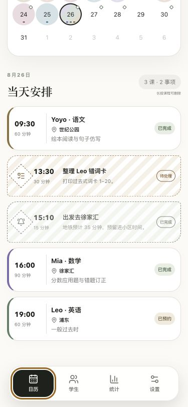

# 家教计薪器

为个人家教老师定制的 iPhone 课表、学生档案与教学统计应用。

> 这是正式版的独立代码库。它不会发布、覆盖或读取 `tutor-log-demo` 求职作品库的数据。



## 安装

需要 Node.js 22 或更高版本。仓库使用 `package-lock.json`，请用 npm 安装依赖：

```bash
npm install
```

启动网页功能预览：

```bash
npm run dev
```

## 快速开始

生成带虚构数据的网页演示版：

```bash
npm run build:demo
npm run preview
```

生成默认空数据的正式 iPhone 版并同步到 iOS 工程：

```bash
npm run ios:sync
```

安装 Xcode 26 或更高版本后，打开工程：

```bash
npm run ios:open
```

## 这是什么？

家教计薪器是一款离线优先的私人家教工作台。它将月历、周课表、重复排课、学生档案、报价收入、通勤成本、真实时薪、本地提醒和加密备份放在一个 iPhone 应用中。

网页链接只用于功能验收，使用独立虚构数据。正式 iOS 构建通过 `VITE_DEMO_MODE=false` 关闭演示数据，首次启动为空档案。

## 为什么要单独建立？

- 求职 Demo 需要保留原有作品链接和演示历史。
- 正式版需要独立的 Bundle ID、本机存储空间和 App Store 发布记录。
- 真实学生数据不应出现在公开演示链接或求职仓库中。

## 已实现功能

- 月历与周课表，包含简略/完整两种周视图。
- 课程按日期区间和周几自动重复。
- 学生专属颜色、授课状态、开始/结课日期和通勤信息。
- 长按课程删除，待办和固定时间提醒独立显示。
- 学生、家长和其他私人评价的上锁档案。
- 按日、周、月、季、年切换的收入、课数和课时统计。
- 基于学生颜色的收款、课时和课数贡献占比。
- 课前提醒和“通勤时间 + 缓冲时间”出发提醒。
- AES-GCM + PBKDF2 密码加密备份与恢复。
- 苹果地图导航和长按拨打家长电话。
- 浅色/深色模式、减少动效适配和 375 px 小屏适配。

## 安全设计

| 能力 | 当前实现 |
|---|---|
| 数据存储 | 网页预览使用独立 LocalStorage；iOS 使用独立 App 容器 |
| 备份加密 | PBKDF2-SHA-256（250,000 次）派生 256 位密钥，AES-GCM 加密 |
| 备份密码 | 仅在内存中用于导出/导入，不持久化 |
| 私密档案 | 独立锁定；网页预览使用本机 PIN |
| 全应用锁 | 已完成解锁界面与状态流程；原生 Face ID 桥接待 Xcode 可用后接入 |
| 本地通知 | Capacitor Local Notifications，不需要后端推送服务 |

## 项目结构

```text
src/                 React 界面、加密备份和原生能力适配
public/              隐私政策、支持页和 PWA 图标
ios/                 Capacitor iPhone 工程
design-system/       本项目的 UI/UX 设计约束
assets/              README 预览图与 App 图标源文件
docs/                GitHub Pages 的编译产物
```

## 开发命令

| 命令 | 作用 |
|---|---|
| `npm run dev` | 启动本地网页演示 |
| `npm run build:demo` | 生成带虚构数据的公开预览 |
| `npm run build:native` | 生成空数据的正式 iPhone 资源 |
| `npm run ios:sync` | 编译正式资源并同步 Capacitor 插件 |
| `npm run ios:open` | 用 Xcode 打开 iOS 工程 |
| `npm test` | 测试加密备份、错误密码和密码长度校验 |

## 当前限制

- 当前 Mac 未安装完整 Xcode，因此暂时无法编译真机包、运行 Face ID 原生验证或上传 TestFlight。
- 公开网页只演示 Face ID 交互，不会尝试访问浏览器中的生物信息。
- 正式版的 App Store 隐私问卷、年龄分级和截图需在功能冻结后再最终确认。

## 隐私与支持

- [隐私政策](./public/privacy.html)
- [支持与数据恢复](./public/support.html)

## 许可

本项目是个人定制应用。代码公开仅用于功能验收和版本发布，未授予复制、修改、分发或商业使用许可。
